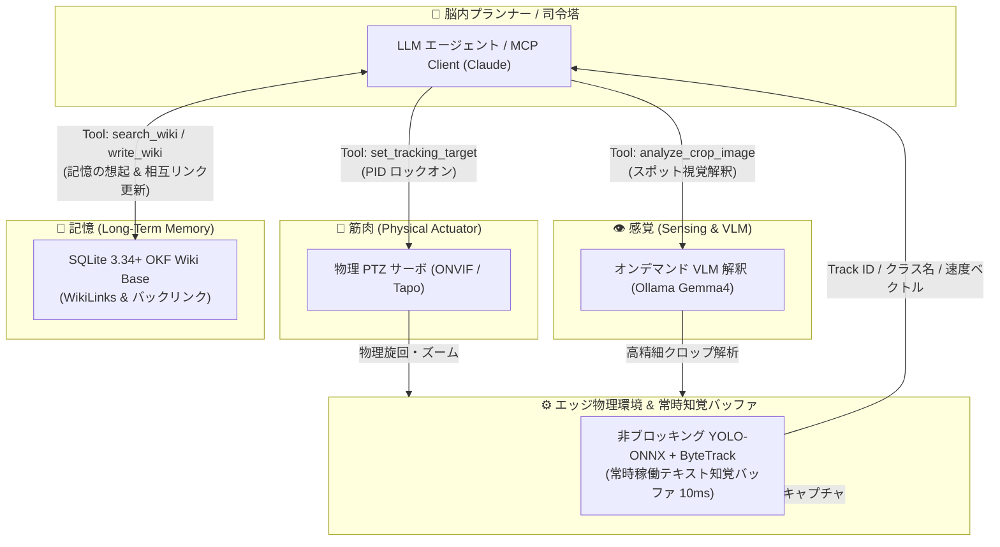

# Pico Argus 👁️🧠

[](https://www.python.org/)
[](https://github.com/astral-sh/uv)
[](LICENSE)
[](https://github.com/astral-sh/ruff)

> **LLM / Multi-Modal AI 統括型「能動的知覚（Active Perception）」エッジAIシステム**
> 
> *ONVIF PTZ 物理制御 × 10ms YOLOテキスト知覚バッファ × オンデマンド VLM 解釈 × SQLite FTS5 / Obsidian (OKF) ナレッジグラフ長期記憶 × MCP (Model Context Protocol) サーバー標準対応*

---

## 🌟 Pico Argus とは？

**Pico Argus** は、エッジPC環境（VRAM 8GB〜12GB）におけるリソース消費を最小限に抑えつつ、LLM（LangGraph / Claude / Ollama）を絶対的な司令塔としてカメラの物理視線移動、高精度クロップ解析、および記憶の蓄積・想起を完全統合する**エージェント主導型アクティブ・パーセプション・システム**です。

神話に登場する不眠不休の百眼の巨人「アルゴス (Argus)」のように、物理カメラを自律操作して環境を視認し、観察事実やユーザーの指示を**ナレッジグラフ（知識網）**として学習・記憶し続けます。

---

## 💡 本システムが解決する 3 つのエッジAI課題

1. **ルールベース追尾による受動性の解消**:
   従来のシステムのように単に動体に反応して画角を動かすのではなく、LLMエージェントが自律的意図を持って「特定のターゲットへ接近し、ズームして解釈し、記憶に記録する」という能動的動作を実現。
2. **常時 VLM 起動による VRAM 枯渇の防止**:
   VLM（マルチモーダルLLM）を常時推論させず通常時はスリープ状態にし、VRAM占有量わずか `500MB` / 推論時間 `10ms` の **YOLO ONNX + ByteTrack** が常時テキスト化知覚バッファとしてステートを更新。意味的精査が必要な瞬間のみオンデマンドで VLM を起動。
3. **`track_id` の限界と長期記憶（Re-ID）の結合**:
   一時的にカウントアップ・消失するトラッカーID (`track_id`) を「使い捨ての数秒間ポインタ」として割り切り、長期的記憶には**「空間絶対座標 ＋ VLM意味的特徴 ＋ WikiLinks 相互ナレッジグラフ」**を用いて同一物を正確に特定（Re-ID）。

---

## 🏗️ システムアーキテクチャ



---

## 🧩 主要コンポーネント & CLI ツール

本システムは独立した役割を持つ 3 つの自律型 CLI および統合 MCP サーバーで構成されています。

| モジュール / CLI | 役割 | 主な機能 |
| :--- | :--- | :--- |
| **`pico.cli.ptz` (`ptz-cli`)** | 筋肉 (Physical Actuator) | ONVIF PTZ 物理制御、PID サーボロックオン、安全クランプ制限、Slew Rate 加減速制御 |
| **`pico.cli.perception` (`perception-cli`)** | 感覚 (Sensing & VLM) | 10ms YOLO-ONNX ＋ ByteTrack テキスト知覚、Ollama VLM (`gemma4:e2b`) スポットクロップ解釈 |
| **`pico.cli.memory` (`memory-cli`)** | 記憶 (Long-Term Memory) | SQLite 3.34+ FTS5 Trigram 日本語想起、Obsidian OKF Markdown 出力、WikiLinks (`[[...]]`) 相互リンク＆バックリンク自動形成、エイリアス名寄せ |
| **`pico.mcp.server`** | MCP 統合サーバー | Claude Code / Claude Desktop / 外部エージェントと連携する MCP (Model Context Protocol) サーバー |

---

## 🛠️ MCP (Model Context Protocol) サーバー仕様

[docs/mcp_specification.md](file:///e:/Python%20Scripts/Pico/docs/mcp_specification.md) に基づき、以下の 8 つのツールを外部 LLM クライアントへ標準提供します：

1. `get_active_tracks`: 常時更新されている YOLO 追跡オブジェクトのテキスト化メタデータを一括高速取得（0ms）。
2. `analyze_crop_image`: 特定オブジェクトのクロップ領域に対する Ollama VLM スポット視覚解析。
3. `set_tracking_target`: 物理 PID サーボによる自動追従ロックオンの開始・解除。
4. `get_live_snapshot`: 人間向け報告用スナップショット画像のキャプチャ。
5. `search_wiki`: SQLite FTS5 Trigram による過去の思い出・行動ルールのミリ秒想起。
6. `write_wiki`: 観測事実・ユーザー指示・検索知見の OKF Markdown 書き込み ＋ WikiLinks / バックリンクリアルタイム更新。
7. `get_perception_status`: 常時知覚エンジンの稼働状況（FPS）、検出中オブジェクト一覧、および能動発火イベント履歴の照会。
8. `configure_event_filter`: 能動的イベント発火の過剰抑止・抑制ルール（クールダウン秒数、監視対象クラス制限）の動的変更。

---

## 🚀 セットアップガイド

### 1. 前提条件
- Python 3.13 以上
- [uv](https://github.com/astral-sh/uv) (パッケージマネージャー)
- Tapo カメラ (C210 等 / RTSP ポート 554 & ONVIF ポート 2020 が利用可能な環境)
- [Ollama](https://ollama.com/) (ローカル VLM 推論用 / 例: `gemma4:e2b`)

### 2. インストール
```powershell
# リポジトリのクローン
git clone https://github.com/chottokun/pico-argus.git
cd pico-argus

# 依存関係の同期
uv sync
```

### 3. 環境変数の設定 (`.env`)
`.env.example` をコピーして `.env` を作成し、接続情報を設定してください：

```powershell
Copy-Item .env.example .env
```

`.env` 設定例:
```ini
TAPO_USER=your_tapo_onvif_username
TAPO_PASS=your_tapo_onvif_password
TAPO_IP=192.168.0.10

OLLAMA_BASE_URL=http://localhost:11434
OLLAMA_MODEL=gemma4:e2b
OLLAMA_MAX_RPM=12
```

### 4. 実機キャリブレーションの実行と動作確認

物理カメラ（Tapo）の可動限界の測定と、物理保護のための安全クランプ限界値を設定ファイルに保存するため、キャリブレーションを実行します。

```powershell
uv run python calibrate_tapo.py
```

実行が完了すると、カメラは物理可動域の真の中心（原点）に移動して停止し、安全クランプ限界値が `tapo_config.json` に保存されます。

---

## 💻 実行方法

### 1. 自律型 CLI ツールの単体実行

#### 筋肉 CLI (`ptz-cli`)
```powershell
# 手動パルス移動 (安全クランプ付き)
uv run ptz-cli --action move --pan 0.15 --tilt -0.08

# 指定 ID の PID 追従ロックオン
uv run ptz-cli --action lockon --id 1

# 緊急停止
uv run ptz-cli --action stop
```

#### 記憶 CLI (`memory-cli`)
```powershell
# SQLite FTS5 Trigram による日本語想起
uv run memory-cli --action search --query "猫のタマちゃん"

# OKF 形式 Markdown への記録 ＋ WikiLinks 相互インデックス登録
uv run memory-cli --action write --file "wiki/known_objects_tama.md" --title "飼い猫タマちゃん" --content "夕方は [[庭 Zone B]] に訪れる。" --tags "pet cat"
```

#### 感覚 CLI (`perception-cli`)
```powershell
# YOLO 追跡トラック一覧をテキストで取得
uv run perception-cli --action get_tracks

# 特定 Track ID のエリアをクロップし VLM 解釈を実行
uv run perception-cli --action analyze_crop --id 1 --query "手元に何を持っていますか？"
```

### 2. MCP サーバーの起動 & クライアントマウント

Claude Code や Claude Desktop から接続するための stdio サーバーを起動します：

```powershell
uv run python -m pico.mcp.server
```

#### Claude Code / Claude Desktop 設定例 (`mcpServers`)
```json
{
  "mcpServers": {
    "cognitive-surveillance": {
      "command": "uv",
      "args": ["run", "python", "-m", "pico.mcp.server"],
      "env": {
        "PYTHONPATH": "."
      }
    }
  }
}
```

---

## 🧪 開発 & テスト (実機なし環境対応)

実機カメラがない環境でも、充実したモック機能とユニットテスト（70件以上）により全コンポーネントのテストが可能です：

```powershell
# 全単体テストの実行 (71件 passed)
uv run pytest

# 静的コードチェック & 自動修正
uv run ruff check --fix

# 依存関係セキュリティ脆弱性監査
uv audit
```

---

## 📘 ドキュメント目次

- [docs/index.md](file:///e:/Python%20Scripts/Pico/docs/index.md): 全ドキュメント総合目次
- [docs/camera_agent.md](file:///e:/Python%20Scripts/Pico/docs/camera_agent.md): 能動的知覚（Active Perception）詳細設計仕様書
- [docs/mcp_specification.md](file:///e:/Python%20Scripts/Pico/docs/mcp_specification.md): MCP サーバー接続・ツール詳細仕様書
- [docs/mcp_usecases.md](file:///e:/Python%20Scripts/Pico/docs/mcp_usecases.md): MCP ユースケース・シナリオ集
- [docs/memory_cli_specification.md](file:///e:/Python%20Scripts/Pico/docs/memory_cli_specification.md): 長期記憶 OKF / ナレッジグラフデータ構造仕様書

---

## 📜 ライセンス・権利表記

本リポジトリのプログラムコードは **[MIT License](LICENSE)** のもとで公開されています。

ただし、本プロジェクトで利用されるサードパーティ製ライブラリおよび AI モデル（YOLOv8, Ollama/Gemma 等の学習済み重み）には、権利者が定めるオリジナルのライセンスが適用されます。

詳細は **[THIRD_PARTY_LICENSES.md](THIRD_PARTY_LICENSES.md)** をご覧ください。
