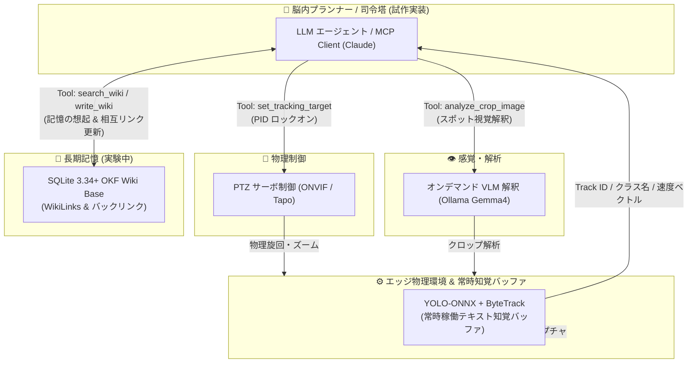

# Pico Argus 👁️🧠

[](https://www.python.org/)
[](https://github.com/astral-sh/uv)
[](LICENSE)
[](https://github.com/astral-sh/ruff)

> **LLM × エッジAIによる「能動的知覚（Active Perception）」の実験的プロトタイプ**
> 
> *ONVIF PTZ 制御 × YOLOテキスト知覚バッファ × オンデマンド VLM 解釈 × SQLite FTS5 / Obsidian (OKF) ナレッジグラフ長期記憶 × MCP サーバー連携の学習・検証*

---

## ⚠️ 本プロジェクトについて（発展途上の実験的コード）

本リポジトリは、**個人の学習および技術検証を目的としたプロトタイプ**です。完成されたプロダクトではなく、技術の勉強・実践として試行錯誤しながら開発を進めています。

- **テストの不足について**: モックを中心とした基本的なユニットテストは一部用意していますが、**実機環境での長期連続稼働や例外処理・エッジケースのテストはまだ不十分**です。予期せぬ動作やエラーが発生する可能性があります。
- **仕様の変更**: 学習が進むにつれて構成や設計方針、API仕様が予告なく変わる可能性があります。
- 勉強中の身ですので、コード改善のご提案やアドバイス、フィードバックなどをいただけますと大変励みになります。

---

## 🌟 Pico Argus とは？

**Pico Argus** は、個人PC環境（VRAM 8GB〜12GB程度）において、「カメラの物理視線制御」「クロップ画像のVLM解析」「ナレッジグラフへの長期記憶」をLLMエージェントから操作・検証するための**実験的アクティブ・パーセプション・システム**です。

ギリシャ神話の百眼の巨人「アルゴス (Argus)」にちなんで名付けましたが、まだまだ発展途上の試作段階です。通常の防犯カメラのような単なるルールベースの動体検知にとどまらず、LLMが「気になったものを自律的に見に行き、確認して記憶する」仕組みをどのように構築できるか試行錯誤しています。

---

## 💡 試みている 3 つのアプローチ・学習テーマ

1. **ルールベース追尾から「意図を持った観察」への挑戦**:
   単に動体に反応してカメラを動かすだけでなく、LLMエージェントが「特定のターゲットに接近し、ズームして詳細を観察し、記録する」という自律的な観察動作を模索しています。
2. **VRAM消費を抑えるオンデマンド VLM 連携**:
   マルチモーダルLLM（VLM）を常時動かすとリソースを大きく消費するため、普段は軽量な **YOLO ONNX + ByteTrack**（VRAM約500MB）で状態を観察し、詳細な意味理解が必要な瞬間のみ VLM を呼び出す構成を試しています。
3. **`track_id` と長期記憶（Re-ID）の組み合わせ**:
   フレーム外への離脱などでリセットされてしまう一時的な `track_id` に頼り切るのではなく、**「空間座標 ＋ VLMの意味的特徴 ＋ ナレッジグラフ」** を使って、同一の対象を長期的・試行的に識別（Re-ID）する方法を勉強中です。

---

## 🏗️ システムアーキテクチャ



---

## 🧩 コンポーネント & CLI ツール

学習・検証がしやすいよう、機能ごとに CLI ツールと MCP サーバーとして分割・実装を進めています。

| モジュール / CLI | 役割 | 現在の実装内容・試み |
| :--- | :--- | :--- |
| **`pico.cli.ptz` (`ptz-cli`)** | 物理制御 | ONVIF PTZ 物理制御、PID サーボロックオンの試み、安全クランプ制限、Slew Rate 加減速 |
| **`pico.cli.perception` (`perception-cli`)** | 感覚・解析 | YOLO-ONNX ＋ ByteTrack テキスト知覚、Ollama VLM (`gemma4:e2b`) スポットクロップ解釈 |
| **`pico.cli.memory` (`memory-cli`)** | 長期記憶 | SQLite 3.34+ FTS5 Trigram 日本語検索、Obsidian OKF Markdown 出力、WikiLinks (`[[...]]`) 相互リンク試行 |
| **`pico.mcp.server`** | MCP 統合 | Claude Code / Claude Desktop / 外部エージェントと連携する MCP (Model Context Protocol) サーバー |

---

## 🛠️ 提供している MCP ツール（試作段階）

外部 LLM から呼び出せるツールとして、現在以下の 8 つを実験的に定義・実装しています：

1. `get_active_tracks`: 現在検出中の YOLO オブジェクト一覧を取得。
2. `analyze_crop_image`: 特定領域のクロップ画像に対する Ollama VLM の試行的視覚解析。
3. `set_tracking_target`: PID サーボによる自動追従ロックオンの制御試み。
4. `get_live_snapshot`: 動作確認用のスナップショット画像キャプチャ。
5. `search_wiki`: SQLite FTS5 による記憶の検索・想起。
6. `write_wiki`: 観測結果などの Markdown 保存と WikiLinks / バックリンク更新。
7. `get_perception_status`: 知覚エンジンのステータスや過去のイベント照会。
8. `configure_event_filter`: イベント発火のクールダウンや監視対象のフィルタ設定。

---

## 🚀 セットアップガイド

### 1. 前提条件
- Python 3.13 以上
- [uv](https://github.com/astral-sh/uv) (パッケージマネージャー)
- Tapo カメラ (C210 等 / RTSP ポート 554 & ONVIF ポート 2020 が利用可能な環境)
- [Ollama](https://ollama.com/) (ローカル VLM 推論用 / 例: `gemma4:e2b`)

### 2. インストール
```powershell
# リポジトリのクローン
git clone https://github.com/chottokun/pico-argus.git
cd pico-argus

# 依存関係の同期
uv sync
```

### 3. 環境変数の設定 (`.env`)
`.env.example` をコピーして `.env` を作成し、接続情報を設定してください：

```powershell
Copy-Item .env.example .env
```

`.env` 設定例:
```ini
TAPO_USER=your_tapo_onvif_username
TAPO_PASS=your_tapo_onvif_password
TAPO_IP=192.168.0.10

OLLAMA_BASE_URL=http://localhost:11434
OLLAMA_MODEL=gemma4:e2b
OLLAMA_MAX_RPM=12
```

### 4. 実機キャリブレーションの実行
物理カメラ（Tapo）の可動域測定と安全制限（安全クランプ値）の取得を行うスクリプトです。

```powershell
uv run python calibrate_tapo.py
```

実行後、安全クランプ限界値が `tapo_config.json` に保存されます。（※実機動作時は壁や障害物への接触にご注意ください）

---

## 💻 実行例

### 1. CLI ツールの個別の動作確認

#### PTZ 制御 CLI (`ptz-cli`)
```powershell
# パルス移動
uv run ptz-cli --action move --pan 0.15 --tilt -0.08

# 指定 ID の PID 追従（実験的実装）
uv run ptz-cli --action lockon --id 1

# 停止
uv run ptz-cli --action stop
```

#### 記憶 CLI (`memory-cli`)
```powershell
# FTS5 Trigram による記憶の検索
uv run memory-cli --action search --query "猫"

# Markdown メモの保存・リンク書き込み
uv run memory-cli --action write --file "wiki/known_objects_tama.md" --title "飼い猫タマちゃん" --content "夕方は [[庭 Zone B]] に訪れる。" --tags "pet cat"
```

#### 感覚 CLI (`perception-cli`)
```powershell
# トラック一覧の表示
uv run perception-cli --action get_tracks

# クロップ画像の VLM 解析
uv run perception-cli --action analyze_crop --id 1 --query "手元に何を持っていますか？"
```

### 2. MCP サーバーの起動

Claude などから呼び出すための stdio サーバーを起動します：

```powershell
uv run python -m pico.mcp.server
```

#### Claude Code / Claude Desktop 設定例 (`mcpServers`)
```json
{
  "mcpServers": {
    "cognitive-surveillance": {
      "command": "uv",
      "args": ["run", "python", "-m", "pico.mcp.server"],
      "env": {
        "PYTHONPATH": "."
      }
    }
  }
}
```

---

## 🧪 テスト・開発状況について

開発にあたり、テストコードの導入とコード品質管理を少しずつ進めています。

```powershell
# ユニットテストの実行 (現時点で約70件のモックテスト)
uv run pytest

# リンター・フォーマッター
uv run ruff check --fix

# 依存関係セキュリティ監査
uv audit
```

> **⚠️ ご注意**:
> 現状のテストはモックを中心とした基礎的な単体テストがメインです。**実機カメラと接続した状態での長時間の統合テストや、エッジケース（通信断絶、急激な暗転、障害物衝突など）の動作検証・テストはまだまだ不十分**です。現在進行形でテストの拡充やコードの改善に取り組んでいます。

---

## 📘 ドキュメント目次

実装のメモや設計アイデアをドキュメントとしてまとめています：

- [docs/index.md](file:///e:/Python%20Scripts/Pico/docs/index.md): ドキュメント総合目次
- [docs/camera_agent.md](file:///e:/Python%20Scripts/Pico/docs/camera_agent.md): 能動的知覚（Active Perception）設計ノート
- [docs/mcp_specification.md](file:///e:/Python%20Scripts/Pico/docs/mcp_specification.md): MCP サーバー・ツール仕様
- [docs/mcp_usecases.md](file:///e:/Python%20Scripts/Pico/docs/mcp_usecases.md): MCP ユースケース・シナリオメモ
- [docs/memory_cli_specification.md](file:///e:/Python%20Scripts/Pico/docs/memory_cli_specification.md): 長期記憶 OKF / ナレッジグラフデータ構造

---

## 📜 ライセンス・権利表記

本リポジトリのコードは **[MIT License](LICENSE)** で公開しています。

利用しているライブラリおよび AI モデル（YOLOv8, Ollama / Gemma など）の権利やライセンスについては、それぞれの開発元の規定に従います。詳細は **[THIRD_PARTY_LICENSES.md](THIRD_PARTY_LICENSES.md)** をご確認ください。
